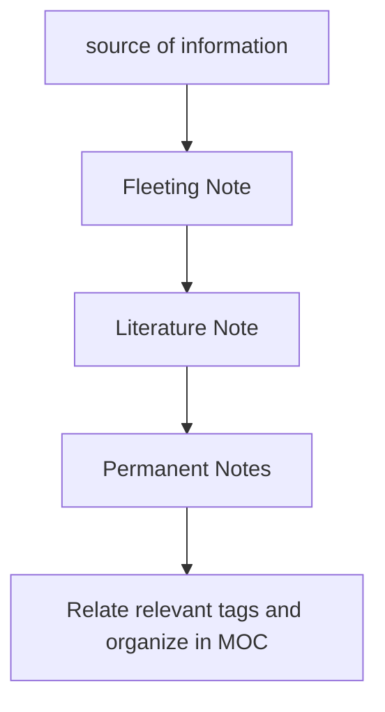

[[004 Systems]]
	`Relevant Tags` : [[mermaid MOC]]

### [[fleeting notes]]
- a idea or thought that should be roughly scribed down, capturing the general summary

### [[literature note]]
- cut down the fat of fleeting notes, should retain the idea without extra fat
- maximum 2-3 sentences, should be in your own words.
- add relvant reference to source 

### [[permanent notes]]
- take existing literature notes and organize, tag and link with existings MOCs or notes.
- take time to think about implications of literature notes develop a chain of thought with other notes
	

