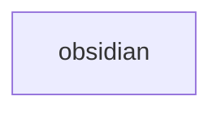
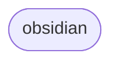
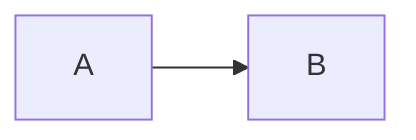
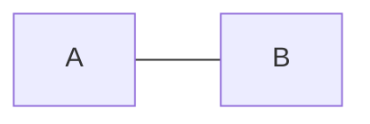
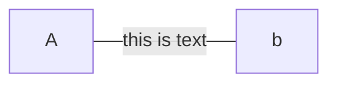
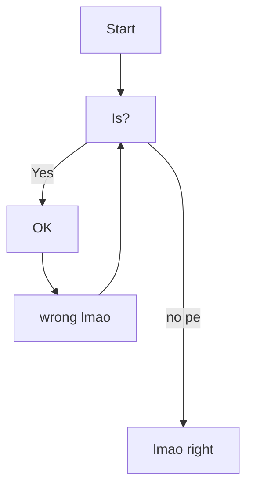

[[010 Interests MOC]]
tags: #coding #systems
links: [[004 Systems]] | [[coding]] | [[javascript]]
url: https://mermaid-js.github.io/mermaid/#/./n00b-syntaxReference

--- 
# Mermaid JS
- a markdown inspired tool for creating flow diagrams.

### simple syntax
- `id#` is a function to create a  unique block of text, 
- `graph` is used to initialize a new chart
- `s`

**Orientation of Graph**
-   TB - top to bottom
-   TD - top-down/ same as top to bottom
-   BT - bottom to top
-   RL - right to left
-   LR - left to right

### node shapes
`id[]` is used for 

`id([])` is used for 

*refer to mermaid syntax url for rest of node shapes*

### linking nodes
- `A-->B` for arrow

- `A --- B` for open link

- `A---|this is text|B` for text in link

### chaining nodes 
- look at edit
   - *note:* using extra `----` will increase the length of the link
